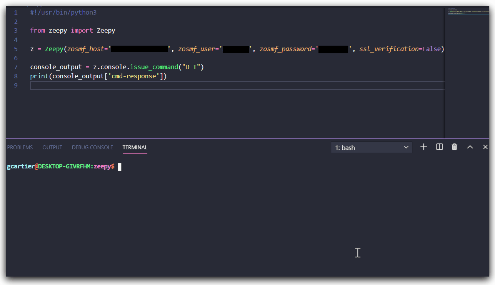

# Zowe Python Client SDK 

 

The Zowe Python Client SDK is an open-source Python package for z/OSMF REST API. It allows you to leverage mainframe capabilities from your python programs with minimum effort.



# Requirements

This package uses `requests-2.22`

# Quick start

Start by importing the Zeepy class and create a object that will be the handler for all z/OSMF requests:

```python
from zeepy import Zeepy

z = Zeepy(zosmf_host='<host address>', zosmf_user='<zosmf user>', zosmf_password='<zosmf password>')
```

# Available options

Currently Zeepy support's the following interfaces:

* Console commands
* z/OSMF Information retrival
* Submit job from dataset
* Submit job from local file
* Submit job as plain text JCL
* Retrieve job status
* Retrieve job list from JES spool
* Start/End TSO address space
* Ping TSO address space
* Issue TSO command

## Console

Usage of the console api on Zeepy
```python
result = z.console.issue_command("<command>")
```
The result will be a JSON object containing the result from z/OSMF

## Job

To retrieve the status of a job on JES
```python
result = z.jobs.get_job_status("<jobname>", "<jobid>")
```

To retrieve list of jobs in JES spool
```python
result = z.jobs.list_jobs(owner="<user>", prefix="<job-prefix>")
```
Additional parameters available are:

* max_jobs
* user_correlator

To submit a job from a dataset:
```python
result = z.jobs.submit_from_mainframe("<dataset-name>")
```

To submit a job from a local file:
```python
result = z.jobs.submit_from_local_file("<file-path>")
```

To submit from plain text:
```python
jcl = '''
//IEFBR14Q JOB (AUTOMATION),CLASS=A,MSGCLASS=0,
//             MSGLEVEL=(1,1),REGION=0M,NOTIFY=&SYSUID
//STEP1    EXEC PGM=IEFBR14
'''

result = z.jobs.submit_from_plaintext(jcl)

```

## TSO

Starting a TSO address space
```python

session_parameters = {
     'proc': 'IZUFPROC',
     'chset': '697',
     'cpage': '1047',
     'rows': '204',
     'cols': '160',
     'rsize': '4096',
     'acct': 'DEFAULT'
}

session_key = z.tso.start_tso_session(**session_parameters)
```
If you don't provide any session parameter Zeepy will attempt to start a session with default parameters.

To end a TSO address space
```python
z.tso.end_tso_session("<session-key>")
``` 

In order to issue a TSO command
```python
tso_output  =  z.tso.issue_command("<tso-command>")
```

## z/OSMF
Usage of the z/OSMF api on Zeepy
```python
result = z.zosmf.get_info()
```
The result will be a JSON object containing z/OSMF information


# Acknowledgments 

* Make sure to check out the [Zowe project](https://github.com/zowe)! 
* For further information on z/OSMF REST API, click [HERE](https://www.ibm.com/support/knowledgecenter/SSLTBW_2.1.0/com.ibm.zos.v2r1.izua700/IZUHPINFO_RESTServices.htm)
