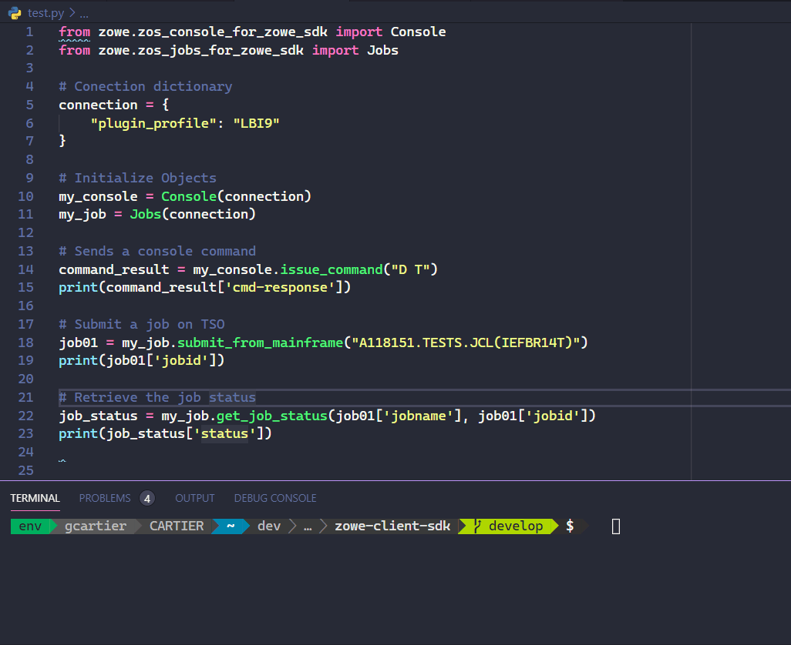

# Zowe Python Client SDK

 [](https://github.com/zowe/zowe-client-python-sdk/releases/latest) [](https://zowe-client-python-sdk.readthedocs.io/en/latest/index.html)

The Zowe Client Python SDK, is a set of Python packages designed to allow programmatic
interactions with z/OS REST API interfaces with minimal effort.

Python developers can leverage the Zowe SDK in order to create powerful scripts/applications
that can interact with z/OS components.



## Installation

When installing the Zowe Client Python SDK, you have two options:

- Install all the Zowe packages
- Install a single sub-package

The choice depends on your intentions. If you choose to install all Zowe SDK packages,
this means that you will install everything under the `zowe` namespace in PyPi.

Alternatively, you can choose to install only a single subpackage for a smaller installation.

To install all Zowe SDK packages using pip:

```
pip install zowe
```

Or, to install a subpackage using pip:

```
pip install zowe.<subpackage>_for_zowe_sdk
```

For more information on the available sub-packages click [HERE](https://zowe-client-python-sdk.readthedocs.io/en/latest/packages/packages.html)

<!--
    **Note**: If you want to stay on the bleeding edge, install the Zowe SDK from the `main` branch with the following command:
    ```
    pip install zowe@git+https://github.com/zowe/zowe-client-python-sdk@main#subdirectory=src
    ```
-->

## Requirements

The Zowe core package has dependencies on the packages listed below:

```
commentjson
deepmerge
jsonschema
pyyaml
requests>=2.22
urllib3
```

It also has an optional dependency on the Zowe Secrets SDK for storing client secrets which can be installed with the `secrets` extra:

```
pip install zowe.core-for-zowe-sdk[secrets]
```

### Developer setup

Ensure the following prerequisites are installed and on your PATH:

- Python >= 3.7 and `pip`
- Cargo >= 1.72 (to build Rust bindings for Secrets SDK)
- Visual Studio Build Tools >= 2015 (Windows only)

Clone the repository using `git`:

```
git clone https://github.com/zowe/zowe-client-python-sdk.git
```

Navigate to the root of the repository and checkout the desired branch. Currently, active development is on the `main` branch:

```
cd zowe-client-python-sdk/
git checkout main
```

We recommend that developers make a virtual environment to install all required dependencies.

Create a virtual environment in the root of the repository folder using the `venv` module.
The command below assumes that `python` is a version of Python3:

```
python -m venv venv
```

_(If this isn't the case for your environment, use the appropriate command alias for Python3)_

Activate your virtual environment so that Python uses it to manage dependencies.
Assuming that you are using Bash shell, reference the command below:

```
source venv/bin/activate
```

Otherwise, check the table titled "Command to activate virtual environment" [here](https://docs.python.org/3/library/venv.html#how-venvs-work) to find the command that works for your shell.

Install the dependencies listed in `requirements.txt` using `pip`:

```
pip install -r requirements.txt
```

You can now develop the Python SDK with the installed dependencies.
When you are finished with your development session, deactivate your virtual environment:

```
deactivate
```

## Quickstart

After you install the package in your project, import the class for the required sub-package (i.e `Console` class for z/OS Console commands).
Create a dictionary to handle communication with the plug-in:

```python
    from zowe.zos_console_for_zowe_sdk import Console
    profile = {
        "host": "example.com",
        "port": 443,
        "user": "<user>",
        "password": "<password>"
    }

    my_console = Console(profile)
```

Alternatively, you can use an existing Zowe CLI profile instead:

```python
    from zowe.zos_core_for_zowe_sdk import ProfileManager
    from zowe.zos_console_for_zowe_sdk import Console

    profile = ProfileManager().load(profile_type="zosmf")
    my_console = Console(profile)
```

**Important**: If your z/OSMF profile uses a credentials manager, this approach may not work depending on your operating system. Support for loading secure profiles has only been tested on Windows and Ubuntu so far.

# Available options

Currently, the Zowe Python SDK supports the following interfaces:

- Console commands
- z/OSMF Information retrieval
- Submit job from a dataset
- Submit job from local file
- Submit job as plain text JCL
- Retrieve job status
- Retrieve job list from JES spool
- Start/End TSO address space
- Ping TSO address space
- Issue TSO command

**Important**: Notice that the below examples assume that you have already created
an object for the sub-package of your preference just like in the quickstart example.

## Console

Usage of the console api:

```python
result = my_console.issue_command("<command>")
```

The result will be a JSON object containing the result from the console command.

## Job

To retrieve the status of a job on JES

```python
result = my_jobs.get_job_status("<jobname>", "<jobid>")
```

To retrieve list of jobs in JES spool

```python
result = my_jobs.list_jobs(owner="<user>", prefix="<job-prefix>")
```

Additional parameters available are:

- max_jobs
- user_correlator

To submit a job from a dataset:

```python
result = my_jobs.submit_from_mainframe("<dataset-name>")
```

To submit a job from a local file:

```python
result = my_jobs.submit_from_local_file("<file-path>")
```

To submit from plain text:

```python
jcl = '''
//IEFBR14Q JOB (AUTOMATION),CLASS=A,MSGCLASS=0,
//             MSGLEVEL=(1,1),REGION=0M,NOTIFY=&SYSUID
//STEP1    EXEC PGM=IEFBR14
'''

result = my_jobs.submit_from_plaintext(jcl)

```

## TSO

Starting a TSO address space

```python

session_parameters = {
     'proc': 'IZUFPROC',
     'chset': '697',
     'cpage': '1047',
     'rows': '204',
     'cols': '160',
     'rsize': '4096',
     'acct': 'DEFAULT'
}

session_key = my_tso.start_tso_session(**session_parameters)
```

If you don't provide any session parameter ZoweSDK will attempt to start a session with default parameters.

To end a TSO address space

```python
my_tso.end_tso_session("<session-key>")
```

In order to issue a TSO command

```python
tso_output  =  my_tso.issue_command("<tso-command>")
```

## z/OSMF

Usage of the z/OSMF api

```python
result = my_zosmf.get_info()
```

The result will be a JSON object containing z/OSMF information

# Acknowledgments

- Make sure to check out the [Zowe project](https://github.com/zowe)!
- For further information on z/OSMF REST API, click [HERE](https://www.ibm.com/support/knowledgecenter/SSLTBW_2.1.0/com.ibm.zos.v2r1.izua700/IZUHPINFO_RESTServices.htm)
